# Simple tree drawing tool
I like to think in trees, it can be useful to write these things down as lists.

atree allows you to write a numbered list, and have it turn into a tree!

## Features
Write numbered lists, get trees!

Output can be either Mermaid formatted data or as generated SVG and PNG files.



## Input - Numbered lists
```
1. Like writing lists
1.1 Write a list
1.2 Read a list
1.3 Realize you need a tool for the list
1.3.1 Write a tool
1.3.1.2 Test the tool
1.3.1.3 Publish the tool on GitHub
1.3.1.4 Realize that you need support for links
1.3.1.4.1 Add the implementation #link 1.3.1
```

## Run the tool - print mermaid text to output
```
cat list.atree | python3 atree.py
```

## Output - Mermaid graph
```{mermaid}
graph TD
    A[Like writing lists]
    AA[Write a list]
    AB[Read a list]
    AC[Realize you need a tool for the list]
    ACA[Write a tool]
    ACAB[Test the tool]
    ACAC[Publish the tool on GitHub]
    A --> AA
    A --> AB
    A --> AC
    AC --> ACA
    ACA --> ACAB
    ACA --> ACAC
```

## Output - Mermaid PNG
Mermaid is run from a docker container using the following
```
docker pull minlag/mermaid-cli
```
```
cat list.atree | python3 atree.py --out example
```

# Tabbed lists
If you just want to quickly write a list without labels, you can do that, and use the ```label.py``` script to auto-label

```
Write a simple list language
    Identify the need for labels
    Write some lists
        Recognise that sometimes tabs are simpler
            They have some downsides
        Consider removing labels
            Realize that labels are needed for links
                Consider a quick mode where you can write tabbed lists quickly
        Write a labelling thingy
    Home for tea and biscuits
```

## Run the tool - print labelled output
```
cat examples/tabbed.txt | python3 label.py
```
This will output:
```
1. Write a simple list language
1.1. Identify the need for labels
1.2. Write some lists
1.2.1. Recognise that sometimes tabs are simpler
1.2.1.1. They have some downsides
1.2.2. Consider removing labels
1.2.2.1. Realize that labels are needed for links
1.2.2.1.1. Consider a quick mode where you can write tabbed lists quickly
1.2.3. Write a labelling thingy
1.3. Home for tea and biscuits
```

This is useful because you can write tabbed lists really quickly, but later, you might want to use #links which requires you to have an ID to link to

You can chain this together to create the images
```
cat examples/tabbed.txt | python3 label.py | python3 atree.py --out tabbed
```



