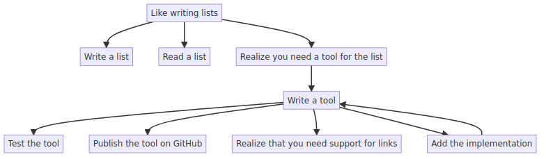

# Simple tree drawing tool
I like to think in trees, it can be useful to write these things down as lists.

atree allows you to write a list, and have it turn into a 
Take a simple numbered list and output a number of trees based on the numbering.



## Input - Numbered lists
```
1. Like writing lists
1.1 Write a list
1.2 Read a list
1.3 Realize you need a tool for the list
1.3.1 Write a tool
1.3.1.2 Test the tool
1.3.1.3 Publish the tool on GitHub
1.3.1.4 Realize that you need support for links
1.3.1.4.1 Add the implementation #link 1.3.1
```

## Run the tool - print mermaid text to output
```
cat list.atree | python3 atree.py
```

## Output - Mermaid graph
```{mermaid}
graph TD
    A[Like writing lists]
    AA[Write a list]
    AB[Read a list]
    AC[Realize you need a tool for the list]
    ACA[Write a tool]
    ACAB[Test the tool]
    ACAC[Publish the tool on GitHub]
    A --> AA
    A --> AB
    A --> AC
    AC --> ACA
    ACA --> ACAB
    ACA --> ACAC
```

## Output - Mermaid PNG
Mermaid is run from a docker container using the following
```
docker pull minlag/mermaid-cli
```
```
cat list.atree | python3 atree.py --out example
```

